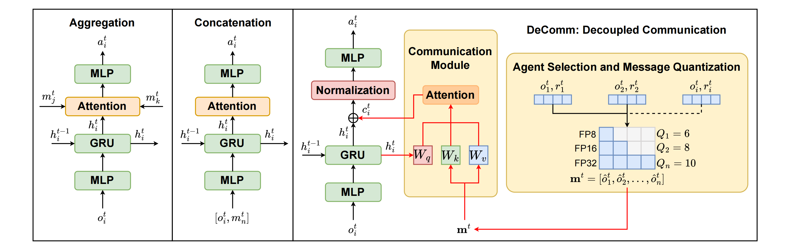

# DeComm: Decoupling Communication in Multi-Agent Reinforcement Learning

This is an official implementation of paper *DeComm: Decoupling Communication in Multi-Agent Reinforcement Learning*

## Introduction

Communication is a powerful mechanism for enhancing coordination in Multi-Agent Reinforcement Learning (MARL) under the Centralized Training and Decentralized Execution (CTDE) framework. However, existing methods often suffer from the rigid message aggregation and fixed functional dependencies, which fail to adapt to varing communication constraints under real-world scenarios. To address these issues, we propose **DeComm**, a novel framework that decouples communication from local policy execution. Unlike traditional architectures that rely on fixed aggregation patterns, DeComm introduces a modular cross-attention extension, which can be jointly optimized during training and selectively activated during deployment without retraining. Furthermore, we incorporate a value-weighted agent selection and message quantization mechanism to minimize overhead while preserving critical information. Experimental results demonstrate that DeComm significantly improves task success rates and communication resilience compared to existing baselines under communication-constrained scenarios.

<div align="center">
  
  <p>Figure 1: Architecture comparison with the DeComm framework</p>
</div>


## Installation instructions

1. Install [pymarl](https://github.com/oxwhirl/pymarl/tree/master)

2. Install [SMAC](https://github.com/oxwhirl/smac) and [SMACv2](https://github.com/oxwhirl/smacv2)

3. Install [Google Research Football](https://github.com/google-research/football)

4. Install environments in [IC3Net](https://github.com/IC3Net/IC3Net)

   ```
   cd Communication/envs/ic3net-envs
   python setup.py develop
   ```

## Run experiments

### SMAC & SMACv2

We provide various training configurations based on **QMIX** and **QPLEX** architectures. Use the `--config` flag to specify the algorithm:

| **Base Algorithm** | **Available Variants**                               |
| ------------------ | ---------------------------------------------------- |
| **QMIX**           | `qmix`, `qmix_cadp`, `qmix_ptde`, `qmix_decomm`     |
| **QPLEX**          | `qplex`, `qplex_cadp`, `qplex_ptde`, `qplex_decomm` |

#### Train

```python
cd SMAC/
python src/main.py --config=qmix_decomm --env-config=sc2 with env_args.map_name=2s3z runner=parallel batch_size_run=16 save_model=True	# SMAC
python main.py --env-config=sc2_gen_terran --config=qplex	# SMACv2
```

All training logs and results are stored in the `CTDE/results/sacred/` directory.

All trained models are automatically saved in the `CTDE/results/models/` directory following the naming convention: `<config_name>__<timestamp>`.

#### Evaluate

To evaluate a specific checkpoint, use the `checkpoint_path` parameter and set `evaluate=True`

**1. Full Communication**

Evaluates the model with full, unconstrained message passing between all agents.

```
python src/main.py --config=qmix_decomm --env-config=sc2 with env_args.map_name=10m_vs_11m evaluate=True checkpoint_path="~/DeComm/CTDE/results/models/<config_name>__<timestamp>"
```

**2. Message Quantization**

Enables communication quantization to reduce bandwidth usage while maintaining coordination.

```
python src/main.py --config=qmix_decomm --env-config=sc2 with  env_args.map_name=10m_vs_11m evaluate=True quantify=True checkpoint_path="~/DeComm/CTDE/results/models/<config_name>__<timestamp>"
```

**3. Agent Selection and Message Quantization**

Limits communication to a subset of agents combined with quantization.

```
python src/main.py --config=qmix_decomm --env-config=sc2 with env_args.map_name=10m_vs_11m evaluate=True comm_agents=4 quantify=True checkpoint_path="~/DeComm/CTDE/results/models/<config_name>__<timestamp>"
```

**4. Fully Decentralized**

Evaluates the model's robustness when communication is entirely disabled during deployment.

```
python src/main.py --config=qmix_decomm --env-config=sc2 with env_args.map_name=2s3z evaluate=True communication=False checkpoint_path="~/DeComm/CTDE/results/models/<config_name>__<timestamp>"
```

### Google Research Football

We compared **DeComm** against several communication-based MARL methods. The corresponding command-line configurations are summarized below:

| **Method**        | **Configuration Flag** |
| ----------------- | ---------------------- |
| CommNet           | `--commnet`            |
| TarMac            | `--tarcomm`            |
| Gated-ACML        | `--gated_acml`         |
| CommFormer        | `--commformer`         |
| HYGMA             | `--hygma`              |
| **DeComm (Ours)** | `--decomm`             |

We provide a modified GRF environment that incorporates communication constraints, configurable via the `--comm_agents` flag.

```python
cd GRF/
python src/scripts/train/train_football.py --env_name football --scenario academy_3_vs_1_with_keeper --n_agent 3 --algorithm_name decomm --experiment_name run_decomm --n_training_threads 8 --n_rollout_threads 8 --n_eval_rollout_threads 1 --num_mini_batch 1 --use_eval --eval_episodes 20 --comm_agents 2 --comm_select_by reward

python src/scripts/train/train_football.py --env_name football --scenario academy_counterattack_hard --n_agent 4 --algorithm_name hygma --experiment_name run_hygma --n_training_threads 32 --n_rollout_threads 32 --n_eval_rollout_threads 1 --num_mini_batch 1 --use_eval --eval_episodes 1 --comm_agents 2 --comm_select_by reward --quantify --hygma_num_groups 2 --hygma_num_layers 2	# for HYGMA
```

### Traffic Junction

The communication-related evaluations were conducted using a dedicated environment to ensure consistency:

- pytorch=1.11.0
- python=3.8
- cuda=11.3

The command-line configurations regarding MARL methods are summarized below:

| **Method**         | **Configuration Flag** |
| ------------------ | ---------------------- |
| CommNet            | `--commnet`            |
| GA-Comm            | `--gacomm`             |
| TarMac             | `--tarcomm --commnet`  |
| IC3Net             | `--ic3net`             |
| MAGIC              | `--magic`              |
| **DeComm (Ours)** | `--decomm`            |

#### Train

```
cd TrafficJuction/
python -u main.py --env_name traffic_junction --nagents 20 --dim 18 --max_steps 80 --add_rate_min 0.05 --add_rate_max 0.05 --difficulty hard --vision 1 --nprocesses 1 --num_epochs 2000 --epoch_size 10 --hid_size 128 --detach_gap 10 --lrate 0.001 --value_coeff 0.01 --recurrent --save --cuda --<method>

python -u main.py --env_name traffic_junction --nagents 20 --dim 18 --max_steps 80 --add_rate_min 0.05 --add_rate_max 0.05 --difficulty hard --vision 1 --nprocesses 1 --num_epochs 2000 --epoch_size 10 --hid_size 128 --directed --gat_num_heads 4 --gat_hid_size 32 --gat_num_heads_out 1 --self_loop_type1 1 --self_loop_type2 1 --first_graph_complete --second_graph_complete --message_decoder --save --cuda --magic # for MAGIC
```

All training logs and results are stored in the `Communication/results/` directory.

All trained models are automatically saved in the `Communication/saved/traffic_junction/` directory following the naming convention: `<method>/<run_number>`.

#### **Evaluate**

Evaluations are conducted in a **bandwidth-limited** `Traffic Junction` environment, where the number of communicating agents is constrained by `--comm_agents`.

The reward-weighted message quantization in DeComm is enabled via `--quantify=True`.

The evaluation automatically loads the latest model checkpoint from the `Communication/saved/traffic_junction/` directory.

```
python -u main.py --env_name traffic_junction --nagents 20 --dim 18 --difficulty hard --vision 1 --add_rate_min 0.05 --add_rate_max 0.05 --recurrent --hid_size 128 --nprocesses 1 --max_steps 80 --evaluate --eval_episodes 100 --comm_agents 16 --<methods_flag>

python -u main.py --env_name traffic_junction --nagents 20 --dim 18 --difficulty hard --vision 1 --add_rate_min 0.05 --add_rate_max 0.05 --recurrent --hid_size 128 --nprocesses 1 --max_steps 80 --evaluate --eval_episodes 100 --quantify=True --decomm # for DeComm

python -u main.py --env_name traffic_junction --nagents 20 --dim 18 --difficulty hard --vision 1 --add_rate_min 0.05 --add_rate_max 0.05 --nprocesses 1 --max_steps 80 --hid_size 128 --directed --gat_num_heads 4 --gat_hid_size 32 --gat_num_heads_out 1 --self_loop_type1 1 --self_loop_type2 1 --first_graph_complete --second_graph_complete --message_decoder --evaluate --eval_episodes 100 --comm_agents 16 --magic	# for MAGIC
```

## Acknowledgements

This repository is developed by modifying and extending the following projects:

- **Core Framework:**
  - [PyMARL](https://github.com/oxwhirl/pymarl)
  - [IC3Net](https://github.com/IC3Net/IC3Net)
- **Algorithms & Baselines:**
  - [CADP](https://github.com/girish21-31/cadp)
  - [PTDE](https://github.com/chenyiqun/ptde-open)
  - [MAGIC](https://www.google.com/search?q=https://github.com/lichengthust/MAGIC)
  - [CommFormer](https://github.com/charleshsc/CommFormer)
  - [HYGMA](https://github.com/mysteryelder/HYGMA)

We would like to express our sincere gratitude to the authors for their valuable contributions and for making their code publicly available.

